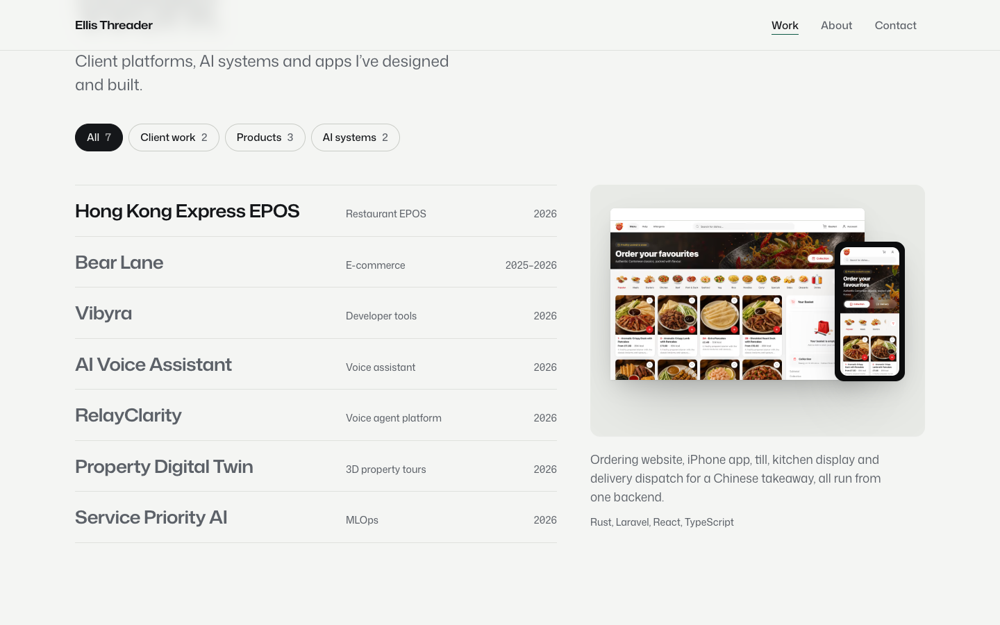
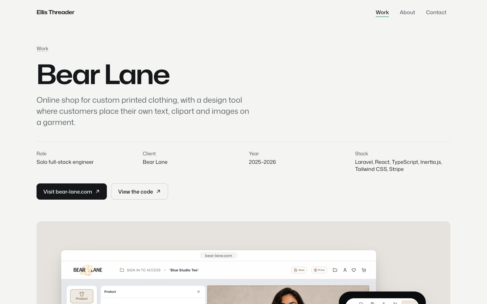

# Ellis Threader — Portfolio

[](https://laravel.com)
[](https://react.dev)
[](https://www.typescriptlang.org)
[](https://tailwindcss.com)

The source for [ellisthreader.com](https://ellisthreader.com): selected work, a case study for every project, and a contact form that emails me directly.


| Home | Work | Case study |
| --- | --- | --- |
|  |  |  |

## How it's built

- **Laravel 13 + Inertia 3 + React 19.** Laravel serves every page and its metadata; React renders it. Titles, descriptions, Open Graph cards and JSON-LD are rendered on the server so link previews work without JavaScript.
- **Content as data.** Projects live in `resources/content/projects.json` (words) and `resources/content/project-media.json` (how each cover is staged). A project marked `"hidden": true` stays in the file but is left off the site.
- **Real screens, consistent frames.** Covers are real screenshots staged in the same browser and phone frames on a tone "plate". Work without a screen, such as the Raspberry Pi assistant, gets a diagram of how the system fits together instead.
- **One typeface.** Mona Sans (variable weight and width), self-hosted and preloaded. The only animation that isn't a response to the visitor is the name settling from condensed to expanded on first load.
- **Light and dark** themes from the same tokens, following the visitor's system setting.
- **Small.** No WebGL, no animation libraries, no UI kit: under 110 KB of JavaScript (gzip) including React.

## Local development

Requirements: PHP 8.3+, Composer, Node 22–24.

```bash
composer install
npm install
cp .env.example .env
php artisan key:generate
php artisan migrate
composer dev        # or: php artisan serve + npm run dev
```

## Adding or updating a project

1. Add the words to `resources/content/projects.json`.
2. Put screenshots in `resources/images/work/<slug>/` (desktop at 2880×1800, phone at 1170×2532) and describe the cover in `resources/content/project-media.json`.
3. `npm run images` renders AVIF/WebP at several widths into `public/images/work/` and updates the manifest.
4. `npm run og` renders the 1200×630 link-preview cards into `public/og/`.

## Commands

| Command | Purpose |
| --- | --- |
| `npm run build` | Production frontend build |
| `npm run images` | Rebuild responsive project images |
| `npm run og` | Rebuild link-preview cards (needs Chrome) |
| `npm run types:check` / `lint:check` / `format:check` | Frontend checks |
| `php artisan test` | Feature tests (pages, case studies, contact form, GitHub activity) |
| `composer lint:check` | Laravel Pint |

## Deployment (Railway)

`railway/init-app.sh` runs migrations and caches config, routes and views before each deploy. Variables:

| Variable | Value |
| --- | --- |
| `APP_NAME` | `Ellis Threader` |
| `APP_ENV` / `APP_DEBUG` | `production` / `false` |
| `APP_URL` | `https://ellisthreader.com` |
| `MAIL_MAILER`, `MAIL_HOST`, `MAIL_PORT`, `MAIL_USERNAME`, `MAIL_PASSWORD`, `MAIL_FROM_ADDRESS` | SMTP details for contact-form delivery (see `.env.railway.example`) |
| `PORTFOLIO_LINKEDIN_URL` | LinkedIn profile; hidden when empty |
| `PORTFOLIO_CV_PATH` | e.g. `/Ellis-Threader-CV.pdf` in `public/`; hidden when empty |
| `PORTFOLIO_AVAILABLE` | `true` shows the availability line |

## Contact

[ellisthreader.com](https://ellisthreader.com) · [GitHub](https://github.com/ellisthreader) · ellis.threader3001@gmail.com
