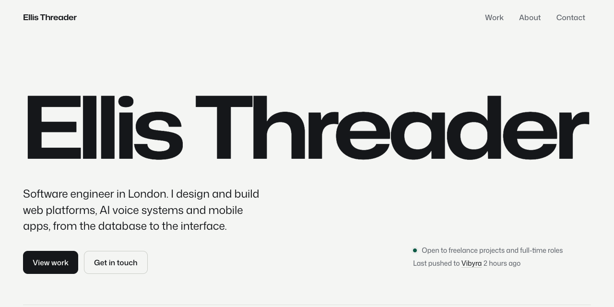
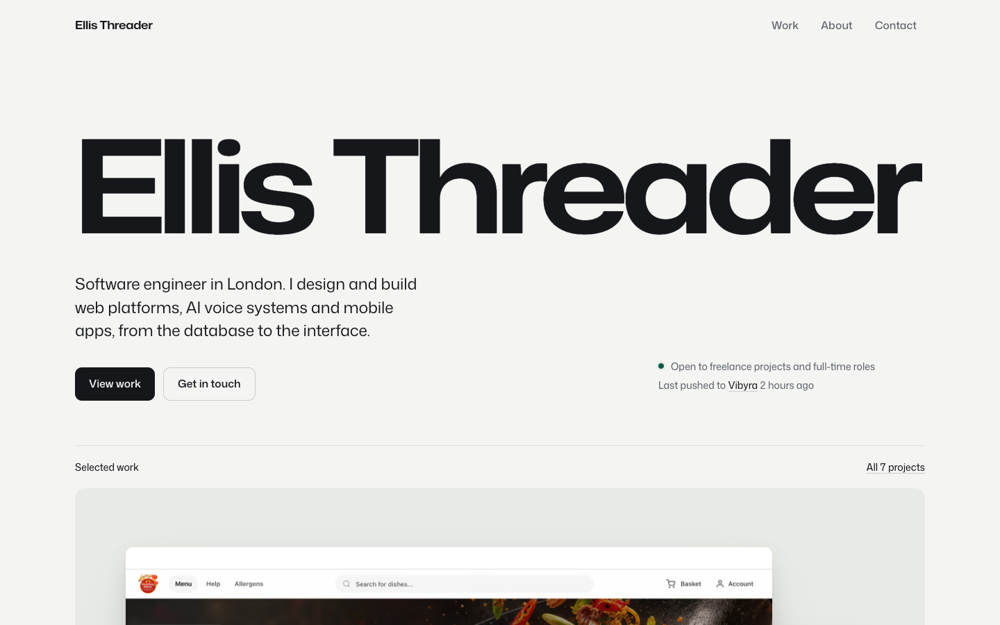
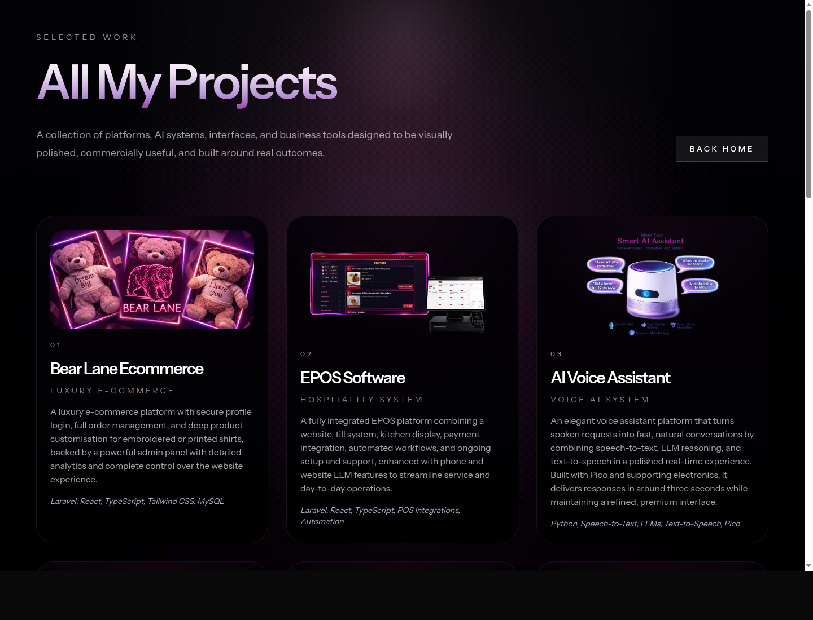
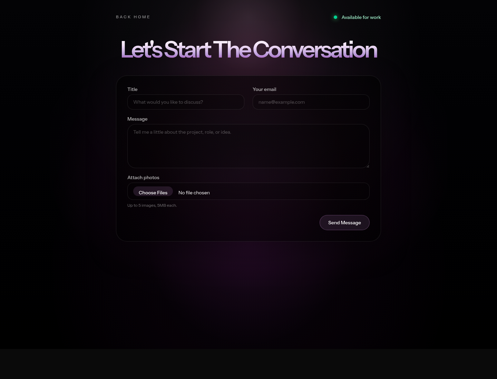

# Ellis Threader Portfolio

[](https://laravel.com)
[](https://react.dev)
[](https://www.typescriptlang.org)
[](https://tailwindcss.com)

A production portfolio for [Ellis Threader](https://ellisthreader.com), built to present full-stack engineering, AI product work, polished interaction design, and a growing archive of client and personal software projects.



## Live Site

**Production:** https://ellisthreader.com

This repository powers the public portfolio, project archive, contact flow, authenticated dashboard shell, and interactive 3D/animated presentation layer.

## Screenshots

| Home | Projects | Contact |
| --- | --- | --- |
|  |  |  |

## What This Shows

- **Full-stack delivery:** Laravel, Inertia, React, TypeScript, Vite, Tailwind CSS, and Railway deployment.
- **Polished frontend engineering:** responsive layouts, scroll-led sections, motion design, 3D scenes, and carefully staged product visuals.
- **Product thinking:** project cards describe real business value, technical scope, and user outcomes rather than only listing tools.
- **Production awareness:** HTTPS-ready URL generation, route caching support, deployment scripts, contact form validation, and database-backed sessions/queues.
- **AI and automation focus:** examples include voice assistants, LLM business platforms, AI resume tooling, accounting automation, and agent-assisted workflow apps.

## Featured Work

| Project | Category | Stack |
| --- | --- | --- |
| Bear Lane Ecommerce | Luxury e-commerce | Laravel, React, TypeScript, Tailwind CSS, MySQL |
| EPOS Software | Hospitality system | Laravel, React, TypeScript, POS integrations, automation |
| AI Voice Assistant | Voice AI system | Python, speech-to-text, LLMs, text-to-speech, Pico |
| Uplifta App | Wellness platform | React Native, TypeScript, UX design, habit tracking |
| Vibyra App | AI workflow command center | React Native, Expo, Laravel, desktop bridge, AI agents |
| RelayClarity | Voice agent deployment platform | React, TypeScript, voice AI, enterprise integrations, evaluation |

## Tech Stack

| Area | Tools |
| --- | --- |
| Backend | Laravel 13, PHP 8.3+, Fortify, database sessions, queues, mail |
| Frontend | React 19, Inertia 3, TypeScript, Vite 8, Tailwind CSS 4 |
| Interaction | Framer Motion, Three.js, React Three Fiber, Drei, model-viewer |
| UI | Radix UI primitives, Lucide icons, custom portfolio components |
| Deployment | Railway, Railpack/FrankenPHP, cached Laravel bootstrap, custom domain |
| Quality | ESLint, Prettier, TypeScript checks, Laravel Pint, Pest/PHPUnit |

## Local Development

### Requirements

- PHP 8.3 or newer
- Composer
- Node.js 22-24
- npm
- SQLite, MySQL, or another Laravel-supported database

### Setup

```bash
composer install
npm install
cp .env.example .env
php artisan key:generate
php artisan migrate
npm run build
```

### Run Locally

```bash
php artisan serve
npm run dev
```

Open http://127.0.0.1:8000.

## Useful Commands

| Command | Purpose |
| --- | --- |
| `npm run build` | Build production frontend assets |
| `npm run lint:check` | Run ESLint checks |
| `npm run format:check` | Check frontend formatting |
| `npm run types:check` | Run TypeScript type checks |
| `php artisan test` | Run Laravel tests |
| `composer lint:check` | Run Laravel Pint in check mode |

## Deployment Notes

The Railway deployment uses the pre-deploy script in `railway/init-app.sh` to run migrations, link storage, clear stale cache, and cache Laravel configuration/routes/views for production.

Recommended Railway variables:

| Variable | Value |
| --- | --- |
| `APP_ENV` | `production` |
| `APP_DEBUG` | `false` |
| `APP_URL` | `https://ellisthreader.com` |
| `PORT` | `8080` |

## Contact

- Website: https://ellisthreader.com
- GitHub: https://github.com/ellisthreader
- Email: ellis.threader3001@gmail.com
